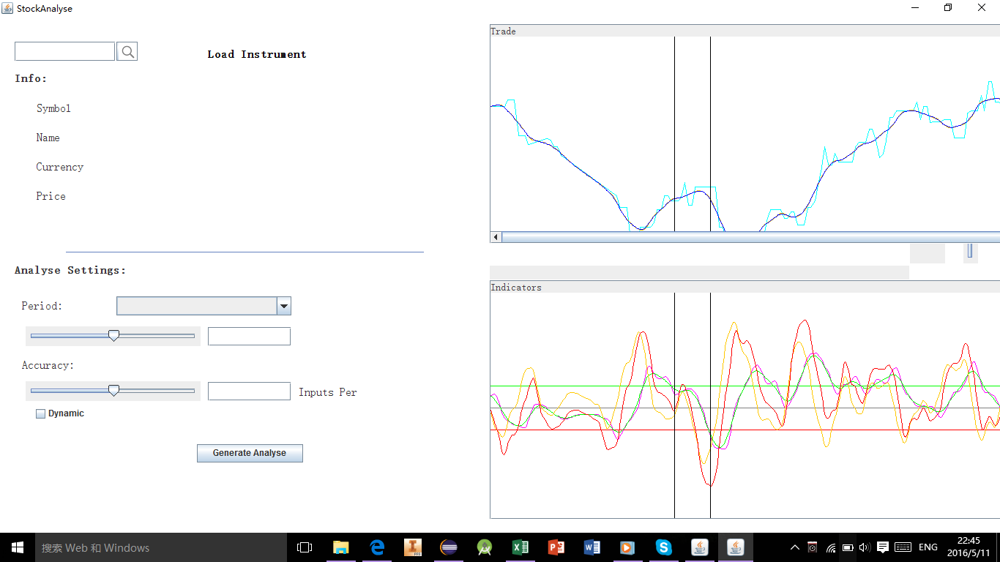

# stock-research

This is an early project of mine from 2016 when I first started programming with java. The project uses the 
[yahoofinance api](https://github.com/sstrickx/yahoofinance-api) and includes a trading simulator (for trading212) 
and a stock data collector. 

## Project screenshots

.png)

.png)

.png)
